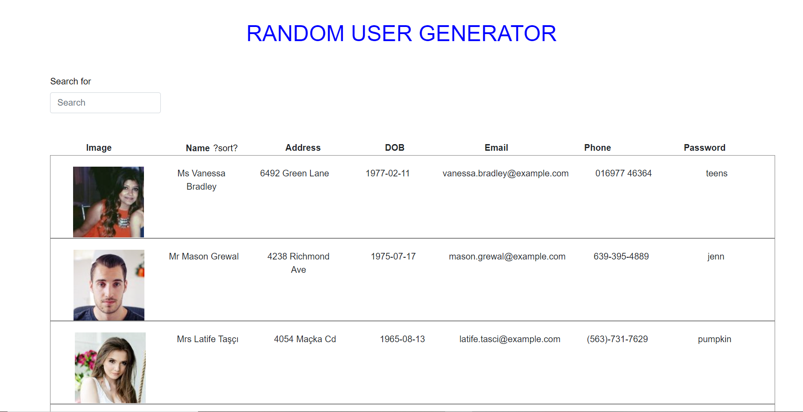
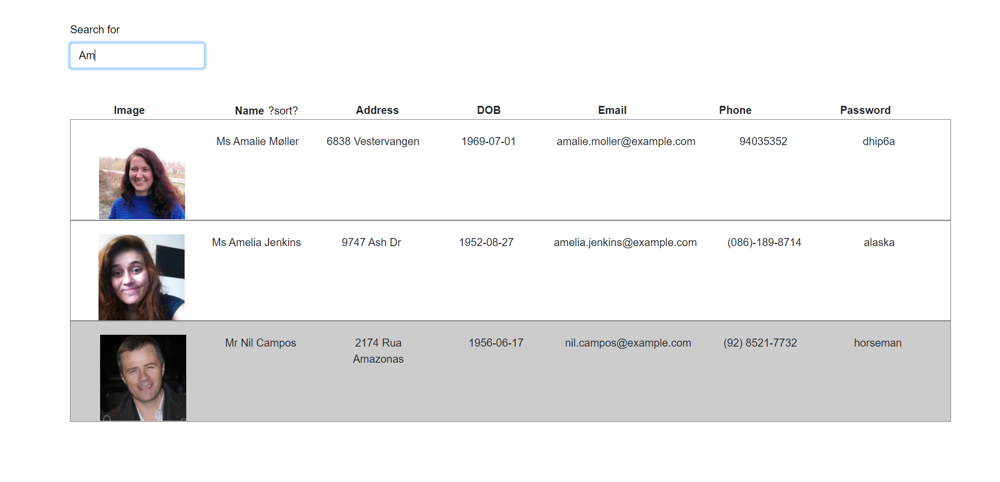
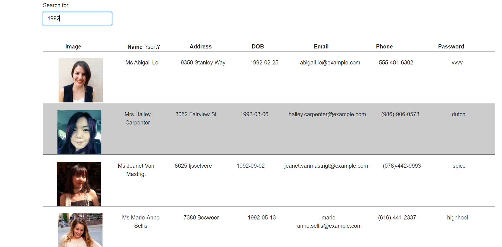
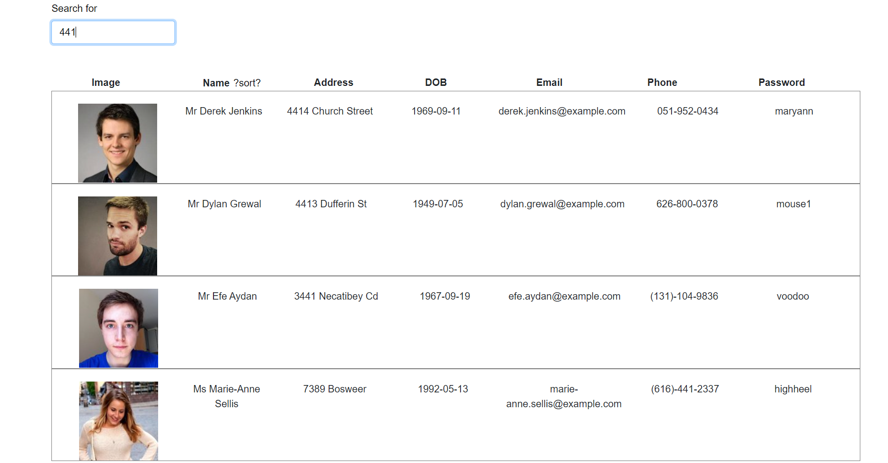

# Online-Offline-Budget-Tracker
## Description
An application that allow user to see random users informations , search through all as well as sort them in alphabetical order.
## Technologies used
* [HTML5](#HTML5)
* [CSS3](#CSS3)
* [NODEJS](#NODEJS)
* [JAVASCRIPT](#JAVASCRIPT)
* [REACT](#REACT)
## Installation
npm intall
## Usage
npm start
## badges
 
#### URL Github Repo:
 https://aminbouzouita.github.io/User-Directory/

#### Screenshots

